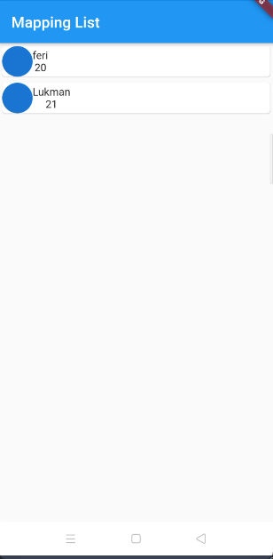
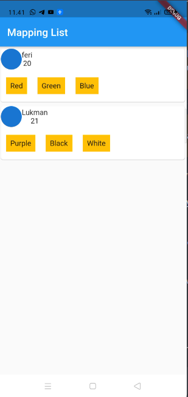
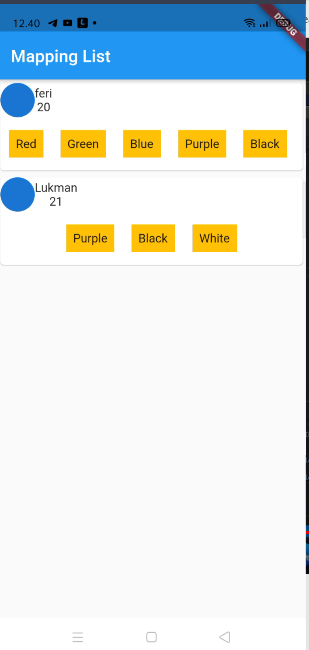

## Mapping

adalah proses extraksi data dari sebuah Mapping agar bisa di extract atau diolah dan ditampilkan di widget UI atau ditampilkan

contoh kita akan mapping list yanng bentuknya seperti ini

```json
{
    'name': 'feri',
    'age': 20,
    'favColor': ['Red', 'Green', 'Blue']
},
{
    'name': 'Lukman',
    'age': 21,
    'favColor': ['Purple', 'Black', 'White']
}
```

dapat kita lihat bahwa tipe `key` map diatas adalah string dan lainya itu bervariasi (`dynamic`) maka kita membuat mapping nya seperti ini

```dart
final List<Map<String, dynamic>> mylist = [
    {
      'name': 'feri',
      'age': 20,
      'favColor': ['Red', 'Green', 'Blue']
    },
    {
      'name': 'Lukman',
      'age': 21,
      'favColor': ['Purple', 'Black', 'White']
    }
  ];
```

jika kita aplikasikan dengan widget nya jadi seperti ini

```dart
import 'package:flutter/material.dart';

class Home extends StatelessWidget {
  final List<Map<String, dynamic>> mylist = [
    {
      'name': 'feri',
      'age': 20,
      'favColor': ['Red', 'Green', 'Blue']
    },
    {
      'name': 'Lukman',
      'age': 21,
      'favColor': ['Purple', 'Black', 'White']
    }
  ];

  @override
  Widget build(BuildContext context) {
    return Scaffold(
      appBar: AppBar(
        title: Text('Mapping List'),
      ),
      body: ListView(
          children: mylist.map((e) {
        return Card(
          child: Column(
            children: [
              Row(
                children: [
                  CircleAvatar(),
                  Column(
                    children: [Text('${e["name"]}'), Text('${e["age"]}')],
                  )
                ],
              )
            ],
          ),
        );
      }).toList()),
    );
  }
}
```

maka jika dijalankan hasilnya akan seperti ini



namun bagaimana jika kita mau ambil nilai `favColor` yang bentuknya list?

seperti ini

```
 'favColor': ['Purple', 'Black', 'White']
```

kita akan tampung dulu di sebuah list dulu baru bisa di mapping contoh seperti ini

```dart
List<dynamic> favColor = e['favColor'];
  return Card(
    child: Column(
      children: [
        Row(
          children: [
            CircleAvatar(),
            Column(
              children: [Text('${e["name"]}'), Text('${e["age"]}')],
            )
          ],
        ),
        Row(
          children: favColor.map((color) {
            return Container(
              child: Text('$color'),
            );
          }).toList(),
        )
      ],
    ),
  );
}).toList()),
```

klo kita modifikasi sedikit menjadi seperti ini

```dart
import 'package:flutter/material.dart';

class Home extends StatelessWidget {
  final List<Map<String, dynamic>> mylist = [
    {
      'name': 'feri',
      'age': 20,
      'favColor': ['Red', 'Green', 'Blue']
    },
    {
      'name': 'Lukman',
      'age': 21,
      'favColor': ['Purple', 'Black', 'White']
    }
  ];

  @override
  Widget build(BuildContext context) {
    return Scaffold(
      appBar: AppBar(
        title: Text('Mapping List'),
      ),
      body: ListView(
          children: mylist.map((e) {
        List<dynamic> favColor = e['favColor'];
        return Card(
          child: Column(
            children: [
              Row(
                children: [
                  CircleAvatar(),
                  Column(
                    children: [Text('${e["name"]}'), Text('${e["age"]}')],
                  )
                ],
              ),
              Row(
                children: favColor.map((color) {
                  return Container(
                    color: Colors.amber,
                    margin: EdgeInsets.symmetric(vertical: 15, horizontal: 10),
                    padding: EdgeInsets.all(8),
                    child: Text('$color'),
                  );
                }).toList(),
              )
            ],
          ),
        );
      }).toList()),
    );
  }
}
```

hasilnya seperti ini



#### menggunakan SingleChildScrollView

klo kita modifikasi sedikit menggunakan `SingleChildScrollView` 

```dart
import 'package:flutter/material.dart';

class Home extends StatelessWidget {
  final List<Map<String, dynamic>> mylist = [
    {
      'name': 'feri',
      'age': 20,
      'favColor': [
        'Red',
        'Green',
        'Blue',
        'Purple',
        'Black',
        'White',
        'Purple',
        'Black',
        'White',
      ]
    },
    {
      'name': 'Lukman',
      'age': 21,
      'favColor': [
        'Purple',
        'Black',
        'White',
      ]
    }
  ];

  @override
  Widget build(BuildContext context) {
    return Scaffold(
      appBar: AppBar(
        title: Text('Mapping List'),
      ),
      body: ListView(
          children: mylist.map((e) {
        List<dynamic> favColor = e['favColor'];
        return Card(
          child: Column(
            children: [
              Row(
                children: [
                  CircleAvatar(),
                  Column(
                    children: [Text('${e["name"]}'), Text('${e["age"]}')],
                  )
                ],
              ),
              SingleChildScrollView(
                scrollDirection: Axis.horizontal,
                child: Row(
                  children: favColor.map((color) {
                    return Container(
                      color: Colors.amber,
                      margin:
                          EdgeInsets.symmetric(vertical: 15, horizontal: 10),
                      padding: EdgeInsets.all(8),
                      child: Text('$color'),
                    );
                  }).toList(),
                ),
              )
            ],
          ),
        );
      }).toList()),
    );
  }
}
```
hasilnya




---

[Penggunaan Statefull](../stateful_sample/README.md) <> [Date Format](../date_formater/README.md)