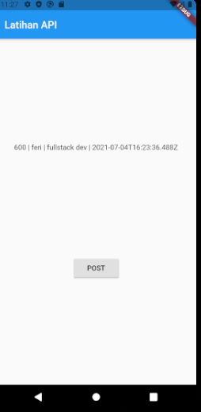

### Bekerja dengan API di Flutter

untuk bekerja degan API atau berkomunikasi dengan API kita perlu 3 hal wajib

1. Membuat Class Model
2. Membuat Factory Method (*digunakan untuk me mapping JSON object tadi ke Class Model yang dibuat*)
3. Method untuk Memanggil API

contoh membuat Model

```dart
// post_result_model.dart

class PostResult {
  String? id;
  String? name;
  String? job;
  String? created;

  // constructor
  PostResult({this.id, this.name, this.job, this.created});
}
```

jadi dimana nanti yang dimasukan parameternya langsung dimasukan ketdalam `field` nya secara otomatis

langkah selanjutnya membuat sebuah `factory method` fungsinya untuk membuat object dari **PostResult**
tapi dia membuat objectnya bertdasarkan hasil Mapping dari `JSON Object` API nya

ketika kita lihat response object dari API nya

```json
{
    "name": "morpheus",
    "job": "leader",
    "id": "31",
    "createdAt": "2021-07-04T12:53:52.368Z"
}
```

dapat kita lihat bahwa response API tersebut memiliki 3 key

* `name`
* `job`
* `id`
* `createdAt`

dan request yang dibutuhkan

```json
{
    "name": "morpheus",
    "job": "leader"
}
```

maka kita buat factory sesuai response dari API misalnya seperti ini

```dart
// factory function
factory PostResult.createPostResult(Map<String, dynamic> jsonObject) {
return PostResult(
  id: jsonObject['id'],
  name: jsonObject['name'],
  job: jsonObject['job'],
  created: jsonObject['createdAt']
);
}
```

kemudian kita buat method untuk memanggil dan mengolah API

```dart
// connect to API method
  static Future<PostResult>connectToAPI(String name, String job) async {
    // api URL
    var apiUrl = Uri.parse("https://reqres.in/api/users");

    // api request to get response
    var apiResult = await http.post(apiUrl, body: {"name": name, "job": job});

    // get json data
    var jsonObjectDecode = json.decode(apiResult.body);

    // return json Object Post Result
    return PostResult.createPostResult(jsonObjectDecode);
}
```

kode lengkapnya seperti ini

```dart
import 'dart:convert';

import 'package:http/http.dart' as http;

class PostResult {
  String? id;
  String? name;
  String? job;
  String? created;

  // constructor
  PostResult({this.id, this.name, this.job, this.created});

  // factory function
  factory PostResult.createPostResult(Map<String, dynamic> jsonObject) {
    return PostResult(
        id: jsonObject['id'],
        name: jsonObject['name'],
        job: jsonObject['job'],
        created: jsonObject['createdAt']);
  }

  // connect to API method
  static Future<PostResult>connectToAPI(String name, String job) async {
    // api URL
    var apiUrl = Uri.parse("https://reqres.in/api/users");

    // api request to get response
    var apiResult = await http.post(apiUrl, body: {"name": name, "job": job});

    // get json data
    var jsonObjectDecode = json.decode(apiResult.body);

    // return json Object Post Result
    return PostResult.createPostResult(jsonObjectDecode);
  }
}
```

atau bisa juga seperti ini


```dart
class PostResult {
  final String? id;
  final String? name;
  final String? job;
  final String? created;

  // constructor
  PostResult({this.id, this.name, this.job, this.created});

  // factory function
  factory PostResult.createPostResult(Map<String, dynamic> jsonObject) {
    return PostResult(
        id: jsonObject['id'],
        name: jsonObject['name'],
        job: jsonObject['job'],
        created: jsonObject['createdAt']);
  }

  // connect to API method
  static Future<PostResult>connectToAPI(String? name, String? job) async {
    // api URL
    var apiUrl = Uri.parse("https://reqres.in/api/users");

    // api request to get response
    var apiResult = await http.post(apiUrl, body: {"name": name, "job": job});

    // get json data
    var jsonObjectDecode = json.decode(apiResult.body);

    // return json Object Post Result
    return PostResult.createPostResult(jsonObjectDecode);
  }
```


#### Menerapkan Pada Main Project

untuk menerapkanya pada project kita cukup panggil modelnya seperti ini

```dart
PostResult? postResult;
```

kemudian kita pake di widget

```dart
Text((postResult != null)
      ? postResult!.id.toString() +
          ' | ' +
          postResult!.name.toString() +
          ' | ' +
          postResult!.job.toString() +
          ' | ' +
          postResult!.created.toString()
      : 'tidak ada tdata'),
  RaisedButton(
    onPressed: () {
      PostResult.connectToAPI('feri', 'fullstack dev')
          .then((value) => postResult = value);
      setState(() {});
    },
    child: Text("POST"),
  ),
```

kode lengkap main

```dart
import 'package:flutter/material.dart';
import 'package:simple_api/post_result_model.dart';

void main() {
  runApp(MyApp());
}

class MyApp extends StatefulWidget {

  @override
  _MyAppState createState() => _MyAppState();

}


class _MyAppState extends State<MyApp> {
  // call model
  PostResult? postResult;

  @override
  Widget build(BuildContext context) {
    return MaterialApp(
      home: Scaffold(
        appBar: AppBar(
          title: Text("Latihan API"),
        ),
        body: Center(
          child: Column(
            mainAxisAlignment: MainAxisAlignment.spaceEvenly,
            children: [
              Text((postResult != null)
                  ? postResult!.id.toString() +
                      ' | ' +
                      postResult!.name.toString() +
                      ' | ' +
                      postResult!.job.toString() +
                      ' | ' +
                      postResult!.created.toString()
                  : 'tidak ada tdata'),
              RaisedButton(
                onPressed: () {
                  PostResult.connectToAPI('feri', 'fullstack dev')
                      .then((value) => postResult = value);
                  setState(() {});
                },
                child: Text("POST"),
              ),
            ],
          ),
        ),
      ),
    );
  }
}
```




###### Package yang digunakan
* https://pub.dev/packages/http

